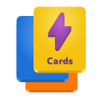
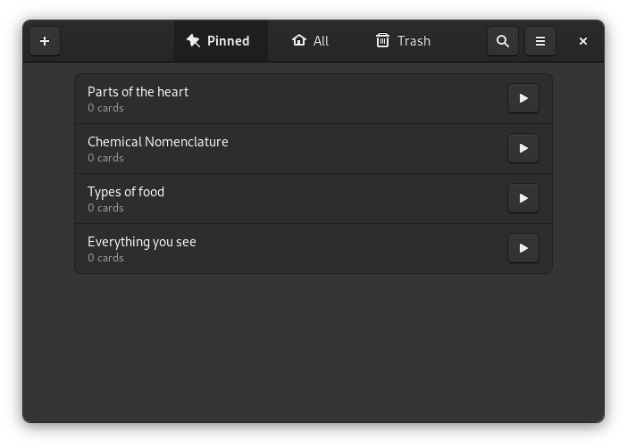

<h1 align="center">
	<br>
	Flashcards
</h1>

<p align="center"><strong>Simple memorizing aid</strong></p>

<p align="center">
  
</p>

## WARNING
This software is still far from usable.


## Description
Flashcards is a simple application which could help you memorize stuff.


## Building from source

### GNOME Builder (Recommended)
GNOME Builder is the environment used for developing this application. It can use Flatpak manifests to create a consistent building and running environment cross-distro. Thus, it is highly recommended you use it.

1. Download [GNOME Builder](https://flathub.org/apps/details/org.gnome.Builder).
2. In Builder, click the "Clone Repository" button at the bottom, using `https://github.com/SeaDve/Flashcards.git` as the URL.
3. Click the build button at the top once the project is loaded.

### Manual with meson
```
git clone https://github.com/SeaDve/Flashcards.git
cd Flashcards
meson builddir --prefix=/usr/local
ninja -C builddir install
```


## Credits

Developed by **[Dave Patrick](https://github.com/SeaDve)**.


## Donate
If you want to support development, consider donating via [PayPal](https://paypal.me/sedve).
